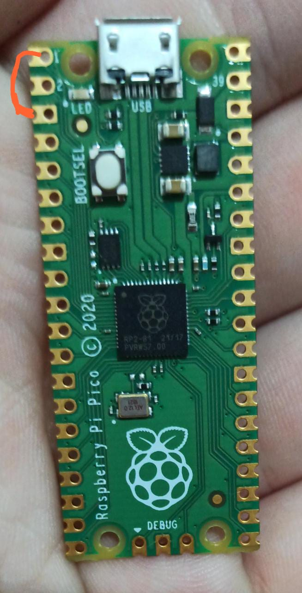

# PicoDucky
Transform your Raspberry Pico into a Rubber Ducky (for education purposes only)

`Step by step`

1- Clone this repo

2- Plug your Raspberry Pico in your computer

3- Copy the circuitpython `.uf2` (found in this repo /adafruit) and Paste it into the RPI-RP2 device root - It will boot and restart as CircuitPY

4- Copy the `adafruit_hid` dir in this repo and Paste it in the `lib` folder of your CircuitPY device

5- Copy `code.py` in the root of this repo and Overwrite the one inside your CircuitPY device

6- Get youself a payload in the payloads section and create a file called `payload.dd` and Paste it inside your CircuitPY device. 
 ******** CircuitPY WILL REBOOT IN 0.5 SEC AND RUN THE PAYLOAD - add  `DELAY 10000` at the begging of the payload, so you'll have a 10 seconds safe margin to remove the device or use your PicoDucky in setup mode *********

7- Keyboard layout Copy the `keyboard_layout.py`, `keyboard_layout_win_LANG.py`, `keycode_win_LANG.py` files to the `lib` folder of your CircuitPY device

8- Go to your `code.py` file in your device

9- Comment these two lines of code

`from adafruit_hid.keyboard_layout_us import KeyboardLayoutUS as KeyboardLayout` 
`from adafruit_hid.keycode import Keycode`

10- Uncomment these other two lines of code and replace `LANG` with the current keyboard_layout files you placed in your device  (e.g LANG => br)

`   
    from keyboard_layout_win_LANG import KeyboardLayout` 
    `from keycode_win_LANG import Keycode
`

#### Setup mode
- Connect pin 1 `GP0` to pin 3 `GND` using a jumper wire

